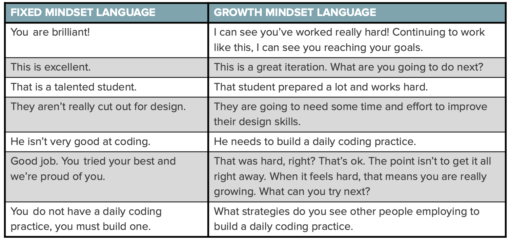

# Science of pair programming
Slides ([link](https://docs.google.com/presentation/d/1nZnYIpEcNhNN71E122PnnVF-s3D85Fa9J1XU_7x0yE4/edit#slide=id.g4cf79cf4e3_0_202))

## How to be a good mentor for pair programming?
1. Build of current knowledge
1. Use Growth mindset
1. Prompt for metacognition

# 1. Current Understanding
1. Create a baseline (understand their approach to the problem)
1. Listen intently
1. Ask the to show you the steps they already took to solve it
1. Cater a reply that will translate to they approach to the problem.

# 2. Growth Mindset
 
