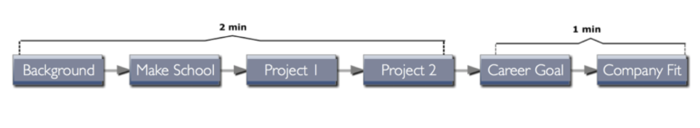
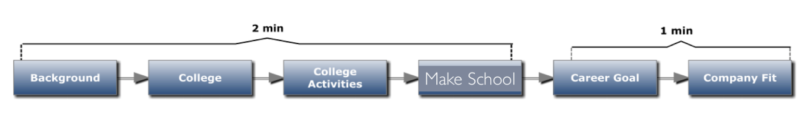
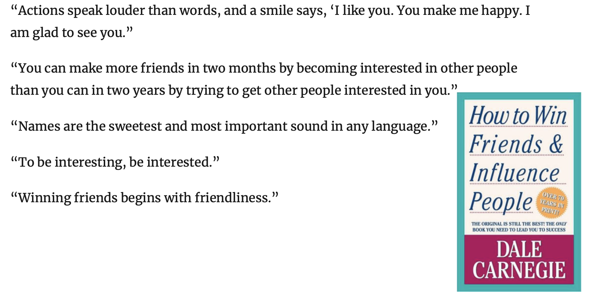

# Attunement
> Slides ([link](https://docs.google.com/presentation/d/1ur2Wp1p2lWnFQfZ1QYGMDXP-87izAul7JnCvVO7lhZI/edit#slide=id.p))

> Pick up someone's pitch and attune to it.

**We shook each other's hands for 3 minutes**

# The "Tell me about yourself"
> Where the fuck do I start?
> Walk them through your resume.

Requirements:
* Do it without bragging
* No wasted tangents

## Personal Odyssey V1

## Personal Odyssey V2

# My Story
* Background
  * Russia
  * Moved a lot
  * Always surrounnded by tech, fell in love with it by visting colleges.
* Make School
  * Started it in my summer as a rising Senior.
  * Fell in love with project based learning.
  * Decided to attend the college.
* REC
  * My first project in iOS
  * Finance
  * I run a real estate company
* Credit-Swag
  * Finance to educate other college students
  * Hired as Product Designer
  * Plan to also help budget
* I want to open my own company
  * Plan to gain as much as possible from my time here
  * Want to push myself to get the most out of time working for the company.
# Fit into a company
“Fit” has 3 Parts:
* Position Fit — you can do the job
* Culture Add — you add to the community
* Mission Fit — you share their purpose

# What can you attune?
* Dress
* Use of jargon
* Level of seriousness and levity
* Tone of voice
* Facial expression
* Emotion
* Body language
