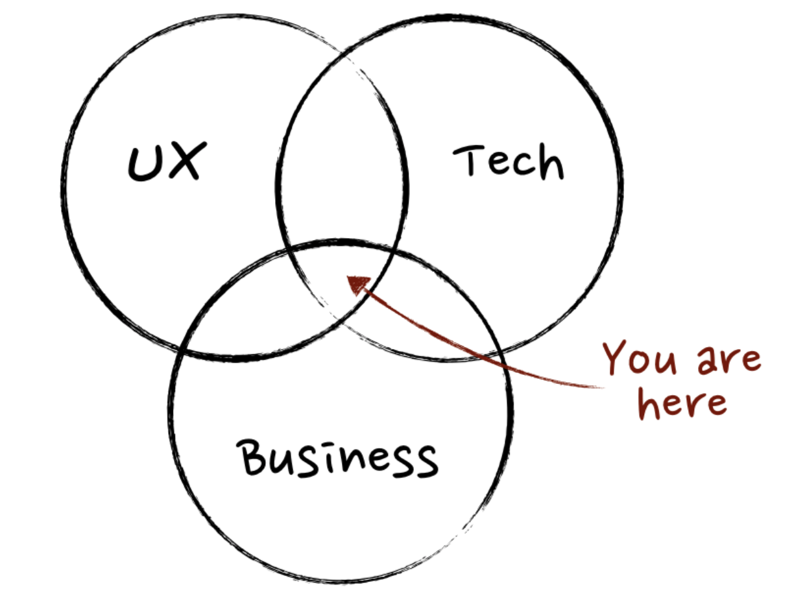
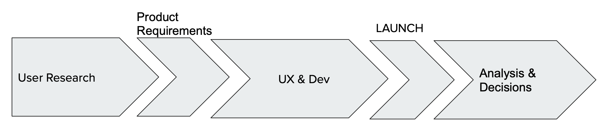
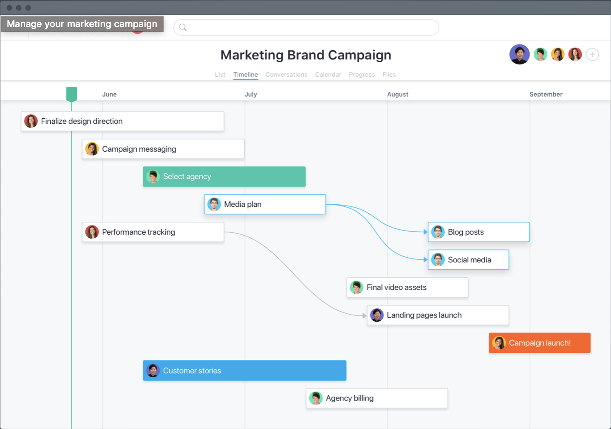

# PM & Communication
Google Slides ([link](https://docs.google.com/presentation/d/1A8gEFcWZoGYUUiSBDctwr1T9SS2BFUcpJ7MlrHthSuo/edit#slide=id.g4cf79cf4e3_0_202))
> People like leaders that see and chase opportunities and potential.

> Enable and grow others. Enable other's to teach you.

# Product Management

Tasks:
* Grow the team
* Engineer happiness
* How many bugs are being fixed
* Stake Holder meetings

Works with:
* **Engineering Team**: building the product
* **Engineering Manager**: allocating engineering resources
* **Executive Teams**: chose high-level strategy
* **Customer Success**: support/onboard customers
* **Marketing**: align messaging with user research
* **Designers**: how will users interact with the product?
* **QA team** (Quality Assurance)
* **Investors** at Small Startups
* **Founders** at Small Startups
* **Sales**: how to get new customers

> PM work on the what and why. Engineers figure out the how.

# Timeline

## Software
> Use a Gantt Chart to plan and track progress.

# Delivering Bad News

1. Get on the side of who's listening
2. Restate the purpose statement
3. Say the bad news
4. State the actions that were already taken to improve the situation

# Analytics
> Very important and underrated.

# Product Requirement Document (PRD)
> A document that stases the what and why of a project.

# How to Protect your time
> Have a deadline and a **drop dead date**. A date when you absolutely have to have it done by.

Have the deadline be 70% of your actual time before the dead drop date.
